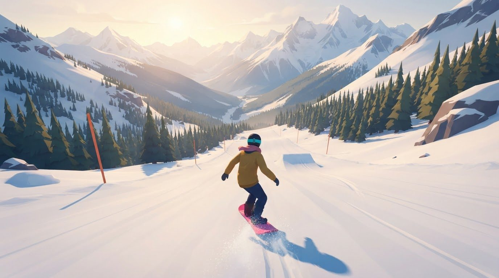

# Mountain Ride

Snowboard-Downhill im Browser, in 3D aus Sicht hinter dem Fahrer. Du fährst einen endlosen Hang frontal hinunter, und es wird mit jedem Meter schneller.

## Spielen

Über einen Webserver öffnen (z. B. `python3 -m http.server` im Ordner, dann http://localhost:8000). Direkt per Doppelklick lädt der Browser die Bilder nicht. Läuft auf Handy und Desktop.

## Steuerung

| Eingabe | Aktion |
| --- | --- |
| Wischen links/rechts · Pfeiltasten · A/D | Lenken |
| Tippen · Wischen nach oben · Leertaste | Springen |
| In der Luft wischen oder ← → | Drehen (360°, 720° …) |

Landen musst du mit dem Brett in Fahrtrichtung, sonst gibt's eine Bruchlandung.

## Inhalt

- 3D mit three.js (per CDN geladen), gemalte Grafik aus `assets/` (Fahrer, Hindernisse, Himmel für Tag/Sonnenuntergang/Nacht/Morgen, Pisten-Textur)
- Prozedural erzeugte, endlose Piste mit Kickern (Sprungschanzen)
- Hindernisse: Bäume, Felsen, Schneemänner, quer liegende Baumstämme
- Münzen, Drehungen, Big Air und perfekte Landungen geben Punkte
- Tempo steigt mit der Strecke, Sichtfeld weitet sich bei hoher Geschwindigkeit
- Tageszeitenwechsel: Tag → Sonnenuntergang → Nacht → Morgen
- Bestwert wird lokal gespeichert
